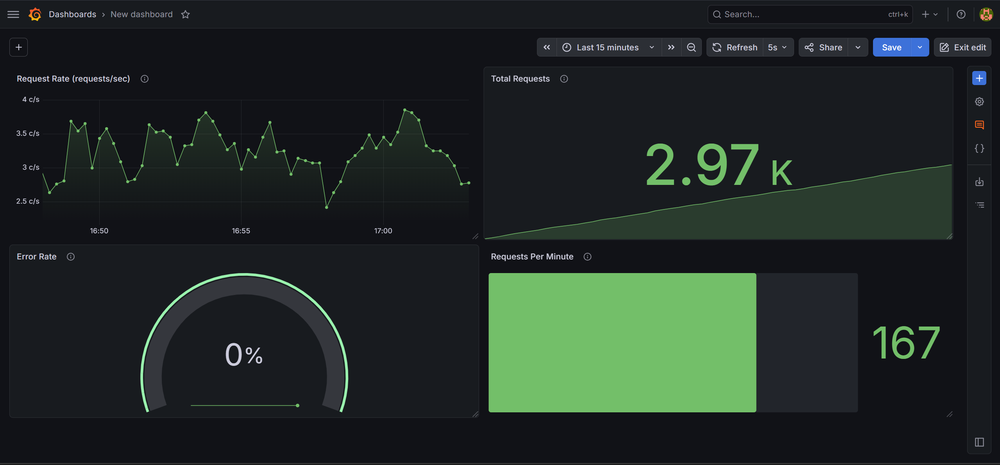

# MCP Gateway

A production-grade Model Context Protocol (MCP) gateway with circuit breaker pattern and full observability stack.

## Overview

MCP Gateway serves as a reverse proxy for MCP-compliant AI tool servers. It routes incoming tool calls to appropriate backend servers, implements circuit breakers for fault tolerance, and provides real-time metrics through Prometheus and Grafana.

**Key Capabilities:**
- MCP protocol support (initialize, tools/list, tools/call)
- Circuit breaker pattern with automatic recovery
- Prometheus metrics collection
- Grafana dashboards for visualization
- Session affinity for stateful operations

## Architecture
```text
Client Request → MCP Gateway → Circuit Breaker → Backend Server
↓
Prometheus
↓
Grafana
```

## Tech Stack

| Component | Technology |
|-----------|------------|
| Gateway | Go 1.21 |
| Metrics | Prometheus |
| Visualization | Grafana |
| Containerization | Docker |
| Protocol | JSON-RPC 2.0 (MCP) |

## Quick Start

### Prerequisites

- Go 1.21 or higher
- Docker and Docker Compose
- Make (optional)

### Installation

```bash
git clone https://github.com/yourusername/mcp-gateway.git
cd mcp-gateway
go mod download
```

### Running the Gateway

Start the mock backend server:
```bash
cd test/mock-server
go run main.go -port=8081 -name=backend-1
```

Start the gateway:
```bash
go run cmd/gateway/main_metrics.go
```

Start monitoring stack:
```bash
docker-compose up -d
```
Access Grafana dashboard at http://localhost:3000 (admin/admin)



## Configuration

Edit `configs/config.yaml` to add or modify backend servers:
```yaml
servers:
  - id: "backend-1"
    name: "Primary Backend"
    url: "http://localhost:8081/mcp"
    transport: "http"
    timeout: 30s
    retry_count: 3
```

## Metrics

The gateway exposes the following Prometheus metrics:

| Metric | Description |
|--------|-------------|
| gateway_requests_total | Total request count by method and status |
| gateway_request_duration_ms | Request duration histogram |
| gateway_server_health | Backend server health status (0/1) |
| gateway_circuit_breaker_state | Circuit state (0=closed, 1=open, 2=half_open) |
| gateway_sessions_active | Number of active client sessions |


### Query Examples

Request rate per second:
```promql
rate(gateway_requests_total[1m])
```

Error rate percentage:
```promql
sum(rate(gateway_requests_total{status="failure"}[1m])) / sum(rate(gateway_requests_total[1m])) * 100
```

## Circuit Breaker

The gateway implements the standard circuit breaker pattern with three states:

| State | Behavior |
|-------|----------|
| CLOSED | Requests pass through normally |
| OPEN | Requests fail fast without calling backend |
| HALF-OPEN | Limited requests test backend recovery |

Configuration:
- Failure threshold: 3 failures
- Timeout: 60 seconds
- Half-open max requests: 3

## Testing

Send a test request:
```bash
curl -X POST http://localhost:8080/mcp \
  -H "Content-Type: application/json" \
  -d '{
    "jsonrpc": "2.0",
    "id": 1,
    "method": "tools/call",
    "params": {
      "name": "echo",
      "arguments": {"message": "Hello"}
    }
  }'
```

## Deployment

### Docker

Build the gateway image:
```bash
docker build -t mcp-gateway .
```

Run with Docker Compose:
```bash
docker-compose up -d
```

## Production Considerations
- Configure TLS for secure communication
- Implement authentication (API keys / JWT)
- Set up alerting based on metrics thresholds
- Use reverse proxy (Nginx) for rate limiting

## Project Status
- Phase 1: Core routing and health checks - Complete
- Phase 2: Session affinity and tool deduplication - Complete
- Phase 3: Circuit breaker implementation - Complete
- Phase 4: Metrics and observability - Complete


## Author
JEEVAN GEORGE JOSEPH

- **GitHub**: [jeevanjoseph03](https://github.com/jeevanjoseph03)
- **LinkedIn**: [jeevanjoseph03](https://www.linkedin.com/in/jeevanjoseph03/)
